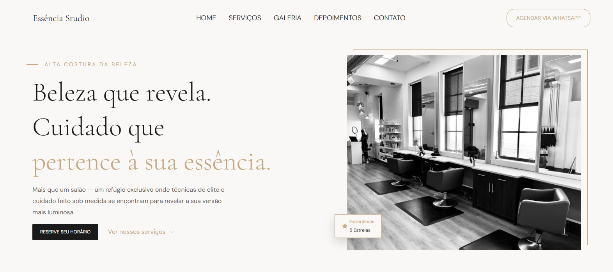

# Landing Page para Salão de Beleza

Este projeto consiste no desenvolvimento de uma landing page otimizada para um salão de beleza, focada em atrair novos clientes através de uma interface visualmente atraente e responsiva.

[Acesse o projeto online aqui](https://lidiavidal.github.io/landingpageSalaoDeBeleza/)
## 🚀 Tecnologias Utilizadas

O projeto foi construído utilizando tecnologias base de desenvolvimento web:

*   **HTML5**: Estruturação semântica do conteúdo.
*   **CSS3**: Estilização, layout responsivo e design da interface.
*   **JavaScript**: Funcionalidades interativas e manipulação do DOM.

## 📁 Estrutura do Projeto

A organização dos arquivos segue uma estrutura lógica:

*   `index.html`: Arquivo principal da landing page.
*   `css/`: Contém os arquivos de estilo (`global.css`, `header.css`, `hero.css`, `style.css`).
*   `assets/`: Recursos visuais e fontes.
    *   `fonts/`: Tipografias customizadas (Cormorant Garamond, DM Sans).
    *   `img/`: Imagens do banner e ícones para diferentes dispositivos.
*   `script.js`: Arquivo de scripts para interatividade.

## 🛠️ Como Executar

1.  Certifique-se de ter um servidor local instalado (ex: Live Server no VS Code).
2.  Clone este repositório para sua máquina local.
3.  Abra o arquivo `index.html` no seu navegador ou inicie através do Live Server.
4.  O projeto já está configurado com a porta `5501` nas configurações do VS Code (`.vscode/settings.json`).

## 🎨 Design e Responsividade

A página foi desenvolvida com foco em **Mobile-First**, garantindo que a experiência do usuário seja excelente tanto em dispositivos móveis quanto em telas grandes, utilizando banners otimizados para cada resolução.
